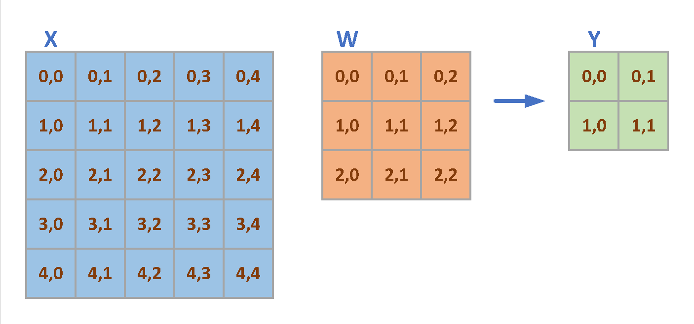
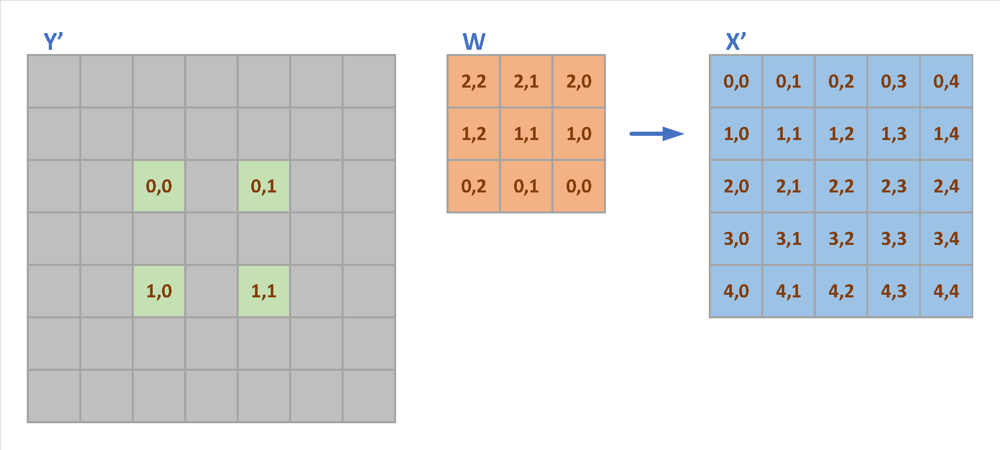
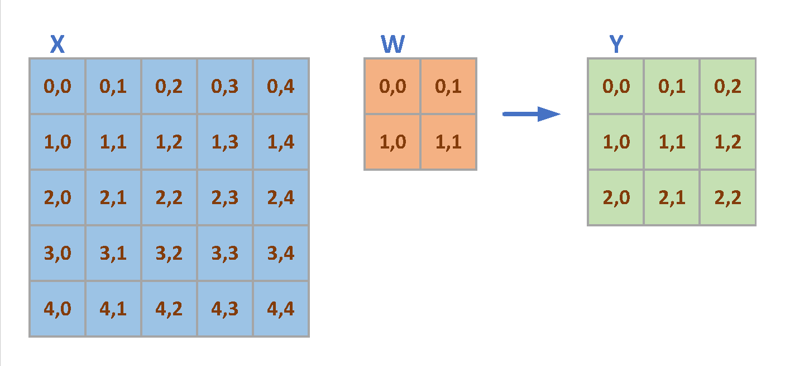
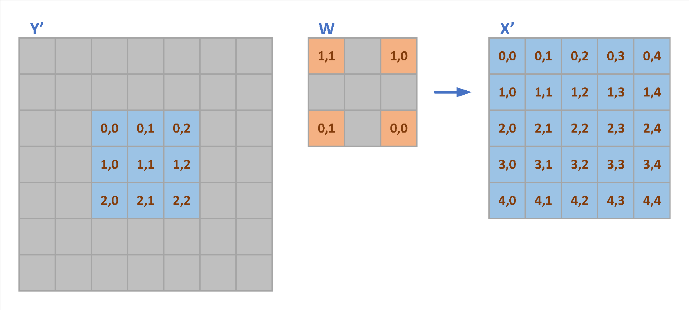

- [1. Back Propagation of Activation](#1-back-propagation-of-activation)
  - [1.1. Stride \> 1](#11-stride--1)
  - [1.2. Dilation \> 1](#12-dilation--1)

# 1. Back Propagation of Activation

As we have discussed in the [Convolution of MMA and Convolution](https://silenceluo.github.io/blogs/Backpropagation), the Backpropagation of Activation (BPA) of convolution can be denoted as following:

$$
d A(h, w) = \sum_{r} \sum_{s} O'( \frac{h+pad_H-r*d_H}{stride_H}, \frac{w+pad_W-s*d_W}{stride_W} ) * W(r, s)  
$$

$$
d A(h, w) = \sum_{p} \sum_{q} O'(p, q) * W(\frac{h-p*stride_H+pad_H}{d_H}, \frac{w-q*stride_W+pad_W}{d_W})  
$$

In this article, we will give examples to explain the BPA of Convolution operation.

## 1.1. Stride > 1

Take a simple stride convolution as an example for BPA. The IA size is $(H=5, W=5)$, the kernel size is $(R=3, S=3)$ and the $(pad_H=0, pad_W=0)$, $(stride_H=2, stride_W=2)$, then the generated OA is $(P=2, Q=2)$ shown in Fig. 1.

  

  Figure 1 Convolution with Stride=2

The FPROP of convolution is as following:

$$
\left\{
\begin{aligned}
Y_{00} &= x_{00}*w_{00} + x_{01}*w_{01} + x_{02}*w_{02} + x_{10}*w_{10} + x_{11}*w_{11} + x_{12}*w_{12} + x_{20}*w_{20} + x_{21}*w_{21} + x_{22}*w_{22}  \\
Y_{01} &= x_{02}*w_{00} + x_{03}*w_{01} + x_{04}*w_{02} + x_{12}*w_{10} + x_{13}*w_{11} + x_{14}*w_{12} + x_{22}*w_{20} + x_{23}*w_{21} + x_{24}*w_{22}  \\
Y_{10} &= x_{20}*w_{00} + x_{21}*w_{01} + x_{22}*w_{02} + x_{30}*w_{10} + x_{31}*w_{11} + x_{32}*w_{12} + x_{40}*w_{20} + x_{41}*w_{21} + x_{42}*w_{22}  \\
Y_{11} &= x_{22}*w_{00} + x_{23}*w_{01} + x_{24}*w_{02} + x_{32}*w_{10} + x_{33}*w_{11} + x_{34}*w_{12} + x_{42}*w_{20} + x_{43}*w_{21} + x_{44}*w_{22} 
\end{aligned}
\right.
$$

The gradient of IA is:

$$
\left\{
\begin{aligned}
\frac{\partial L}{\partial x_{00}}  &= \frac{\partial L}{\partial Y_{00}} * w_{00}  \\
\frac{\partial L}{\partial x_{01}}  &= \frac{\partial L}{\partial Y_{00}} * w_{01}  \\
\frac{\partial L}{\partial x_{02}}  &= \frac{\partial L}{\partial Y_{00}} * w_{02} + \frac{\partial L}{\partial Y_{01}} * w_{00} \\
\frac{\partial L}{\partial x_{03}}  &= \frac{\partial L}{\partial Y_{01}} * w_{01}  \\
\frac{\partial L}{\partial x_{04}}  &= \frac{\partial L}{\partial Y_{01}} * w_{02}  \\
\end{aligned}
\right.
$$

$$
\left\{
\begin{aligned}
\frac{\partial L}{\partial x_{10}}  &= \frac{\partial L}{\partial Y_{00}} * w_{10}  \\
\frac{\partial L}{\partial x_{11}}  &= \frac{\partial L}{\partial Y_{00}} * w_{11}  \\
\frac{\partial L}{\partial x_{12}}  &= \frac{\partial L}{\partial Y_{00}} * w_{12} + \frac{\partial L}{\partial Y_{01}} * w_{10} \\
\frac{\partial L}{\partial x_{13}}  &= \frac{\partial L}{\partial Y_{01}} * w_{11}  \\
\frac{\partial L}{\partial x_{14}}  &= \frac{\partial L}{\partial Y_{01}} * w_{12}  \\
\end{aligned}
\right.
$$

$$
\left\{
\begin{aligned}
\frac{\partial L}{\partial x_{20}}  &= \frac{\partial L}{\partial Y_{00}} * w_{20} + \frac{\partial L}{\partial Y_{10}} * w_{00} \\
\frac{\partial L}{\partial x_{21}}  &= \frac{\partial L}{\partial Y_{00}} * w_{21} + \frac{\partial L}{\partial Y_{10}} * w_{01} \\
\frac{\partial L}{\partial x_{22}}  &= \frac{\partial L}{\partial Y_{00}} * w_{22} + \frac{\partial L}{\partial Y_{01}} * w_{20} + \frac{\partial L}{\partial Y_{11}} * w_{00} \\
\frac{\partial L}{\partial x_{23}}  &= \frac{\partial L}{\partial Y_{01}} * w_{21} + \frac{\partial L}{\partial Y_{11}} * w_{01} \\
\frac{\partial L}{\partial x_{24}}  &= \frac{\partial L}{\partial Y_{01}} * w_{22} + \frac{\partial L}{\partial Y_{11}} * w_{02} \\
\end{aligned}
\right.
$$

$$
\left\{
\begin{aligned}
\frac{\partial L}{\partial x_{30}}  &= \frac{\partial L}{\partial Y_{10}} * w_{10}  \\
\frac{\partial L}{\partial x_{31}}  &= \frac{\partial L}{\partial Y_{10}} * w_{11}  \\
\frac{\partial L}{\partial x_{32}}  &= \frac{\partial L}{\partial Y_{10}} * w_{12} + \frac{\partial L}{\partial Y_{11}} * w_{10} \\
\frac{\partial L}{\partial x_{33}}  &= \frac{\partial L}{\partial Y_{11}} * w_{11}  \\
\frac{\partial L}{\partial x_{34}}  &= \frac{\partial L}{\partial Y_{11}} * w_{12}  \\
\end{aligned}
\right.
$$

$$
\left\{
\begin{aligned}
\frac{\partial L}{\partial x_{40}}  &= \frac{\partial L}{\partial Y_{10}} * w_{20}  \\
\frac{\partial L}{\partial x_{41}}  &= \frac{\partial L}{\partial Y_{10}} * w_{21}  \\
\frac{\partial L}{\partial x_{42}}  &= \frac{\partial L}{\partial Y_{10}} * w_{22} + \frac{\partial L}{\partial Y_{11}} * w_{20} \\
\frac{\partial L}{\partial x_{43}}  &= \frac{\partial L}{\partial Y_{11}} * w_{21}  \\
\frac{\partial L}{\partial x_{44}}  &= \frac{\partial L}{\partial Y_{11}} * w_{22}  \\
\end{aligned}
\right.
$$

  

  Figure 2 Convolution with Stride=2

The above gradient can be denoted as the convolution of dilated $Y'$ and $W$, shown as in Fig 2. It shows that the BPA of the strided convolution is a convolution of dilated $Y'$ and $W$, and the $W$ is $180^{\circ}$ rotated. 

## 1.2. Dilation > 1

For Dilated Convolution, we have a similar example shown in Fig. 3, in which IA size is $(H=5, W=5)$ , and Kernel size is $(R=2, S=2)$, dilation size is $(d_H=2, d_W=2)$ and the generated OA size is $(P=3, Q=3)$.

  

  Figure 3 Convolution with Stride=2

The OA elements are generated as following:

$$
\left\{
\begin{aligned}
Y_{00} &= x_{00}*w_{00} + x_{02}*w_{01} + x_{20}*w_{10} + x_{22}*w_{11}  \\
Y_{01} &= x_{01}*w_{00} + x_{03}*w_{01} + x_{21}*w_{10} + x_{23}*w_{11}  \\
Y_{02} &= x_{02}*w_{00} + x_{04}*w_{01} + x_{22}*w_{10} + x_{24}*w_{11}  \\
Y_{10} &= x_{10}*w_{00} + x_{12}*w_{01} + x_{30}*w_{10} + x_{32}*w_{11}  \\
Y_{11} &= x_{11}*w_{00} + x_{13}*w_{01} + x_{31}*w_{10} + x_{33}*w_{11}  \\
Y_{12} &= x_{12}*w_{00} + x_{14}*w_{01} + x_{32}*w_{10} + x_{34}*w_{11}  \\
Y_{20} &= x_{20}*w_{00} + x_{22}*w_{01} + x_{40}*w_{10} + x_{42}*w_{11}  \\
Y_{21} &= x_{21}*w_{00} + x_{23}*w_{01} + x_{41}*w_{10} + x_{43}*w_{11}  \\
Y_{22} &= x_{22}*w_{00} + x_{24}*w_{01} + x_{42}*w_{10} + x_{44}*w_{11} 
\end{aligned}
\right.
$$

The gradient of IA can be denoted as following:

$$
\left\{
\begin{aligned}
\frac{\partial L}{\partial x_{00}}  &= \frac{\partial L}{\partial Y_{00}} * w_{00}  \\
\frac{\partial L}{\partial x_{01}}  &= \frac{\partial L}{\partial Y_{01}} * w_{00}  \\
\frac{\partial L}{\partial x_{02}}  &= \frac{\partial L}{\partial Y_{00}} * w_{01} + \frac{\partial L}{\partial Y_{02}} * w_{00} \\
\frac{\partial L}{\partial x_{03}}  &= \frac{\partial L}{\partial Y_{01}} * w_{01}  \\
\frac{\partial L}{\partial x_{04}}  &= \frac{\partial L}{\partial Y_{02}} * w_{01}  \\
\end{aligned}
\right.
$$

$$
\left\{
\begin{aligned}
\frac{\partial L}{\partial x_{10}}  &= \frac{\partial L}{\partial Y_{10}} * w_{00}  \\
\frac{\partial L}{\partial x_{11}}  &= \frac{\partial L}{\partial Y_{11}} * w_{00}  \\
\frac{\partial L}{\partial x_{12}}  &= \frac{\partial L}{\partial Y_{10}} * w_{01} + \frac{\partial L}{\partial Y_{12}} * w_{00} \\
\frac{\partial L}{\partial x_{13}}  &= \frac{\partial L}{\partial Y_{11}} * w_{01}  \\
\frac{\partial L}{\partial x_{14}}  &= \frac{\partial L}{\partial Y_{12}} * w_{01}  \\
\end{aligned}
\right.
$$

$$
\left\{
\begin{aligned}
\frac{\partial L}{\partial x_{20}}  &= \frac{\partial L}{\partial Y_{00}} * w_{10} + \frac{\partial L}{\partial Y_{20}} * w_{00} \\
\frac{\partial L}{\partial x_{21}}  &= \frac{\partial L}{\partial Y_{01}} * w_{10} + \frac{\partial L}{\partial Y_{21}} * w_{00}  \\
\frac{\partial L}{\partial x_{22}}  &= \frac{\partial L}{\partial Y_{00}} * w_{11} + \frac{\partial L}{\partial Y_{02}} * w_{10} + \frac{\partial L}{\partial Y_{22}} * w_{00} \\
\frac{\partial L}{\partial x_{23}}  &= \frac{\partial L}{\partial Y_{01}} * w_{11} + \frac{\partial L}{\partial Y_{21}} * w_{01} \\
\frac{\partial L}{\partial x_{24}}  &= \frac{\partial L}{\partial Y_{02}} * w_{11} + \frac{\partial L}{\partial Y_{11}} * w_{01}   \\
\end{aligned}
\right.
$$

$$
\left\{
\begin{aligned}
\frac{\partial L}{\partial x_{30}}  &= \frac{\partial L}{\partial Y_{10}} * w_{10}  \\
\frac{\partial L}{\partial x_{31}}  &= \frac{\partial L}{\partial Y_{11}} * w_{10}  \\
\frac{\partial L}{\partial x_{32}}  &= \frac{\partial L}{\partial Y_{12}} * w_{10} + \frac{\partial L}{\partial Y_{10}} * w_{11} \\
\frac{\partial L}{\partial x_{33}}  &= \frac{\partial L}{\partial Y_{11}} * w_{11}  \\
\frac{\partial L}{\partial x_{34}}  &= \frac{\partial L}{\partial Y_{12}} * w_{11}  \\
\end{aligned}
\right.
$$

$$
\left\{
\begin{aligned}
\frac{\partial L}{\partial x_{40}}  &= \frac{\partial L}{\partial Y_{20}} * w_{10}  \\
\frac{\partial L}{\partial x_{41}}  &= \frac{\partial L}{\partial Y_{21}} * w_{10}  \\
\frac{\partial L}{\partial x_{42}}  &= \frac{\partial L}{\partial Y_{22}} * w_{10} + \frac{\partial L}{\partial Y_{20}} * w_{11} \\
\frac{\partial L}{\partial x_{43}}  &= \frac{\partial L}{\partial Y_{21}} * w_{11}  \\
\frac{\partial L}{\partial x_{44}}  &= \frac{\partial L}{\partial Y_{22}} * w_{11}  \\
\end{aligned}
\right.
$$

The above equations denote the convolutions of $Y'$ and dilated $W$, which can be shown in Fig. 4.

  

  Figure 4 Convolution with Stride=2

Fig. 4 shows that the BPA of the dilated convolution is a convolution of $Y'$ and dilated $W$, and the $W$ is $180^{\circ}$ rotated. 

