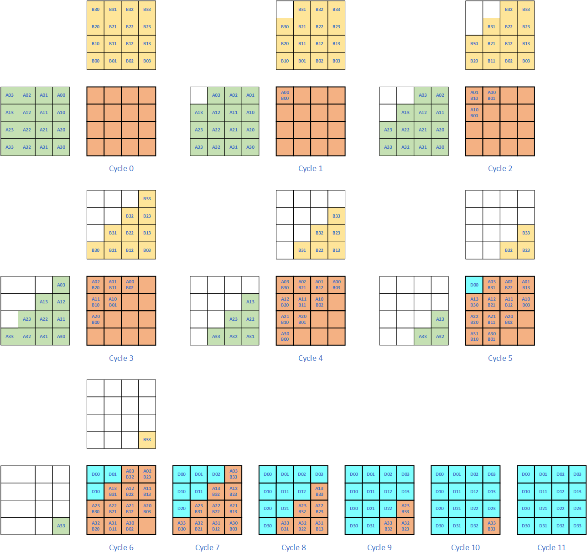

# 1. History of Processor

The most import processor family, CPU, was designed to process common processing work and it is not enough to handle mass computational work. It is designed to process 2 data per cycle at the beginning, and some other extensions with higher computation power has been added later, but CPU is still very far from the requirement of AI work.

To accelerate computational intensive work, different kinds of accelerators have been designed to achieve higher performance. 

## 1.1. Vector * Vector

Vector Cores are the most basic computation unit in GPU and GPGPUs, they are called CUDA cores in Nvidia platform. Instead of processing element by element, Vector Cores process one group/array of data per instruction. For example, in Nvidia SIMT-32 architecture, each instruction will execute 32 threads simutaneously, and for the Vector multiplication operation shown below with $N=32$, each $A[i]$ and $B[i]$ with $0<=i<32$ is sent to one lane of the Vector Core.

$$
D[N-1 : 0] = A[N-1 : 0] \times B[N-1 : 0]+ C[N-1 : 0]
$$

Thus Vector Core has much higher computation density than CPU.

## 1.2. Vector * Matrix

With the emerging of AI, many NPU are designed to accelerate the Convolution and MMA computation. The most commonly used architecture in early days are the $Vector \times Matrix$ NPU. It computes the following equation with $A[M-1 : 0][K-1 : 0]$ is a $M \times K$ matrix, while $B[K-1 : 0]$ is a K element vector. This operation yields a Vector $D[M-1 : 0]$ per cycle.

$$
D[M-1 : 0] = A[M-1 : 0][K-1 : 0] \times B[K-1 : 0] + C[M-1 : 0]
$$

  

  Figure 3 Vector*Matrix

This $Vector \times Matrix$ processor has  $M \times K$ multipliers, and omparing with $Vector \times Vector$ processor, it has much higher computation density. 

  

  Figure 3 Cambricon NPU Architecture with Vector*Matrix

## 1.3. Matrix * Matrix

While most of the computation in AI can be transferred to MMA operation, processor with $Matrix \times Matrix$ operation are the mainstream of AI accelerator today. It computes the following operations:

$$
D[M-1 : 0][N-1 : 0] = A[M-1 : 0][K-1 : 0] \times B[K-1 : 0][N-1 : 0] + C[M-1 : 0][N-1 : 0]
$$

In tihs equation, the size of matrix $A$ is $M \times K$, the size of $B$ is $K \times N$ which the size of C and D is $M \times N$. It has $M * N * K$ multipliers in each MMA unit, thus is has much higher computation density than Vecotr Core and $Vector \times Matrix$ unit. 

  

  Figure 3 Matrix*Matrix

 

## 1.4. Systolic Array

Systolic Array is a special MMA processor, but it has the same number of multipliers as $Vector \times Matrix$

  

  Figure 3 Systolic Array Flow

## 1.5 Comparison of Different Processor

Let us compare different kinds of acceleraters in names of Data Reuse Ratio and other benchmarks. 

| Accelerator Type        | Multiplier Num  | Data size     | Data Reuse Ratio (Mul/Data) | Data Dimension  | Multipliers Dimension |
| --                      | --              | --            | :--:                        | :--:            | :--:  |
| CPU                     | 1               | 2             | 0.5                         | 0               | 0   |
| Vector Core             | N               | 2*N           | 0.5                         | 1               | 1   |
| Vector $\times$ Matrix  | M * K           | M*K + K       | $\frac{N}{N+1}$             | 1, 2            | 2   |
| MMA                     | M * N * K       | M*N + N*K     | $\frac{N}{2}$               | 2               | 3   |
| Systolic                | M * N           | M*N + N*K     | 0.5                         | 2               | 2   |

